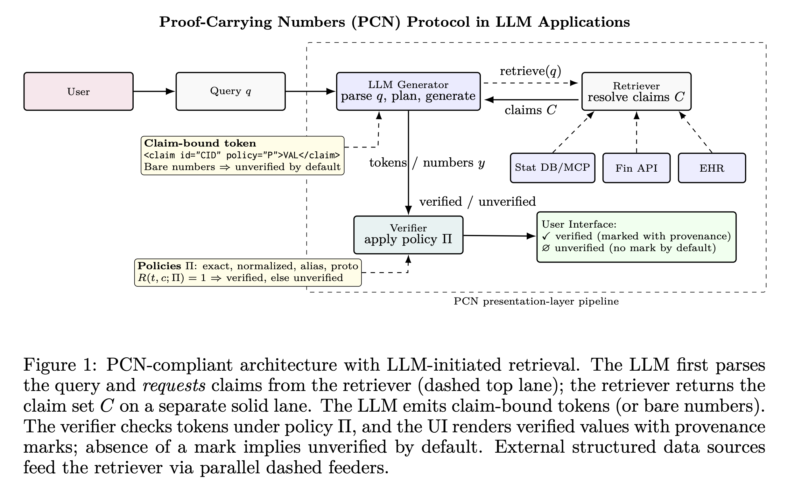

# Proof-Carrying Numbers (PCN)

**Proof-Carrying Numbers (PCN)** is a presentation-layer protocol that enforces numeric fidelity in LLM-generated content through mechanical verification. PCN ensures that numbers displayed to users are verified against source data, highlighting numeric hallucinations when they occur and establishing trust through proof.

> **Audience**: This project is designed for developers, researchers, and organizations working with LLM-generated content where numeric accuracy is critical, including financial reporting, scientific data presentation, development data dissemination, and regulatory compliance applications.


<!-- Screenshot placeholder: Add a screenshot or diagram showing PCN verification in action -->




## The Problem: Numeric Hallucination

Large Language Models (LLMs) are stochastic systems that may generate numbers that deviate from available data—a failure known as **numeric hallucination**. Existing safeguards like retrieval-augmented generation, citations, and uncertainty estimation improve transparency but cannot guarantee fidelity: fabricated or misquoted values may still be displayed as if correct.

## The Solution: Mechanical Verification

PCN enforces numeric fidelity by placing verification in the **renderer**, not the model. Under PCN:

- **Claim-bound tokens**: Numeric spans are emitted as tokens tied to structured claims
- **Policy-based verification**: A verifier checks each token under a declared policy (e.g., exact equality, rounding, aliases, or tolerance with qualifiers)
- **Fail-closed behavior**: Only claim-checked numbers are marked as verified; all others default to unverified
- **Spoofing prevention**: The separation of verification from generation prevents models from marking numbers as verified

## Key Features

✅ **Model-agnostic**: Works with any LLM or text generation system

✅ **Lightweight**: Minimal overhead, integrates seamlessly into existing applications

✅ **Formally verified**: Proven soundness, completeness, fail-closed behavior, and monotonicity

✅ **Extensible**: Can be extended with cryptographic commitments

✅ **Policy-flexible**: Supports various verification policies (exact match, rounding, tolerance, aliases)

## Core Principle

> **Trust is earned only by proof** — the absence of a verification mark communicates uncertainty.

## Project Structure

This monorepo contains the **PCN ecosystem**:

- **TypeScript packages** (`packages/*`) — Published to npm under `@pcn/*`
  - `@pcn/core` — Core PCN implementation
  - `@pcn/fixtures` — Shared test fixtures
  - `@pcn/ui` — React UI components for verified/pending claims

- **Python packages** (`python/*`) — Published to PyPI under `pcn-*`
  - `pcn-core` — Core PCN implementation for Python
  - `pcn-fixtures` — Shared test fixtures for Python

- **Specifications** (`specs/*`) — Source of truth across languages
  - Policy schema definitions
  - Shared test fixtures

- **Documentation** (`docs/*`) — Intended for GitBook sync

## Quick Start

### JavaScript/TypeScript

```bash
# Enable corepack (for pnpm)
corepack enable

# Install dependencies
pnpm install

# Run tests
pnpm -r test

# Build all packages
pnpm -r build
```

### Python

```bash
# Install development dependencies
python -m pip install -e "python/pcn-core[dev]"

# Run tests
pytest -q python/pcn-core
```

## Use Cases

PCN is designed for **numerically sensitive settings** where accuracy matters:

- Trustworthiness in AI dissemination of development data
- Financial reporting and analysis
- Scientific data presentation
- Medical statistics and research
- Legal and regulatory compliance
- Educational content with quantitative claims

## Documentation

Comprehensive documentation is available:

- [Documentation](docs/) — Detailed guides and reference materials
- [Policy Reference](docs/reference/policies.md) — Understanding PCN verification policies
- [Contributing Guide](CONTRIBUTING.md) — How to contribute to PCN
- [Code of Conduct](CODE_OF_CONDUCT.md) — Community guidelines

> **Note**: For web-based documentation accessible to non-technical audiences, see the [documentation website](https://avsolatorio.github.io/pcn) (when available).

## Contact

For questions, issues, or contributions, please contact:

<!-- - **World Bank GitHub**: [github@worldbank.org](mailto:github@worldbank.org) -->
- **Project Maintainers**: [avsolatorio@gmail.com](mailto:avsolatorio@gmail.com)

Alternatively, you can:
- Open an issue on [GitHub Issues](https://github.com/avsolatorio/pcn/issues)
- Start a discussion on [GitHub Discussions](https://github.com/avsolatorio/pcn/discussions)

## License

This project is licensed under the MIT License together with the World Bank IGO Rider. The Rider is purely procedural: it reserves all privileges and immunities enjoyed by the World Bank, without adding restrictions to the MIT permissions. Please review both files before using, distributing or contributing.

See [LICENSE](LICENSE) for the full license text.


## Citation

If you use PCN in your research, please cite it as:

```bibtex
@misc{solatorio2025proofcarryingnumberspcnprotocol,
  title         = {Proof-Carrying Numbers (PCN): A Protocol for Trustworthy Numeric Answers from LLMs via Claim Verification},
  author        = {Aivin V. Solatorio},
  year          = {2025},
  eprint        = {2509.06902},
  archiveprefix = {arXiv},
  primaryclass  = {cs.CL},
  url           = {https://arxiv.org/abs/2509.06902},
  keywords      = {LLM, Numeric Hallucination, Verification, Proof-Carrying, Trust, AI Safety}
}